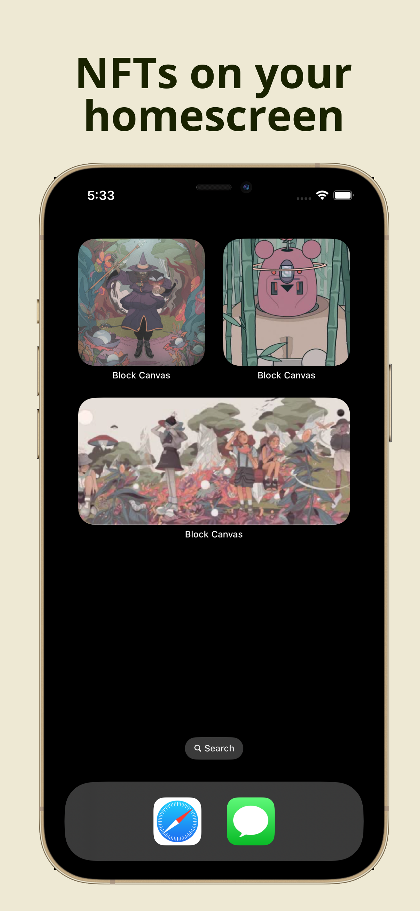

# Block Canvas

    

Block Canvas is an innovative NFT application focusing on AR visualization, integrated wallet browsing, and real-time crypto price updates tailored for art enthusiasts.

    

## Features

- Immersive AR integration allows for virtual display of art-themed NFTs in the real world.
- Animated portfolio view elegantly showcases the NFT collections contained within.
- Dynamic NFT recommendations powered by ChatGPT, customizing user experiences based on wallet insights.
- Real-time price curves dedicated to Ethereum and XTZ updates.

## Technical Highlights

- Integrated **RESTful & GraphQL APIs** to streamline data fetching, leveraging **Grand Central Dispatch** for enhanced concurrency.
- Utilized OpenAI's **ChatGPT** to offer dynamic, AI-driven NFT recommendations based on user wallet activity.
- Employed **SwiftUI** techniques to craft immersive NFT animations and real-time Ethereum and XTZ price visualizations.
- Capitalized on **ARKit** to enable users to project NFTs into real-world environments seamlessly.
- Leveraged **WidgetKit** to introduce customizable NFT widgets for home screens, highlighting flexibility with Intents Extension.

## Libraries

- Kingfisher
- SnapKit
- lottie-ios
- JGProgressHUD
- MJRefresh
- Crashlytics
- SwiftLint

## Requirement

- **Development**: Xcode 14.0 or later
- **Deployment**: iOS 16.0 or later

## Contact

Renee Hsu

[piaoyunh@gmail.com](mailto:piaoyunh@gmail.com)

[LinkedIn](https://www.linkedin.com/in/reneepyh/)

## License

Distributed under the MIT License.
